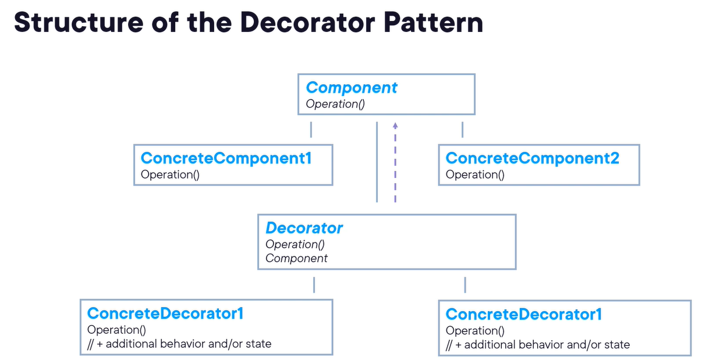

# Decorator Pattern #

## Implementation Senario: 
### ***Collecting statistics & stroing emails***

- The intent of this patter is to attach additional responsibilities to an object dynamically. 
- A decorator thus provides a flexible alternative to subclassing for extneding functionality. 
- Also Called ***a Wrapper***

## Use Cases
- When you have a need to add responsibilities to individual objects dynamically (at runtime) without affecting other objects
- When you need to be able to withdraw responsibilities you attached to an object
- When extention by subclassing is impractical or impossible

> Examples
- Adding logging and monitoring capabilities
- Formatting text in text editors
- Adding authentication/authorization layers
- Enhancing the appearance or behavior of your GUI elements

## Pattern consequnces
- More flexible than using static iheritance via subclassing: responsibilities can be added and revmoved at runtime ad hoc
- You can use the pattern to split feature-loaded classes until there's just one responsibility left per class: `single responsibiliti principle`
- Increased effort is required to learn the system dueto the amount of small, simple classes
