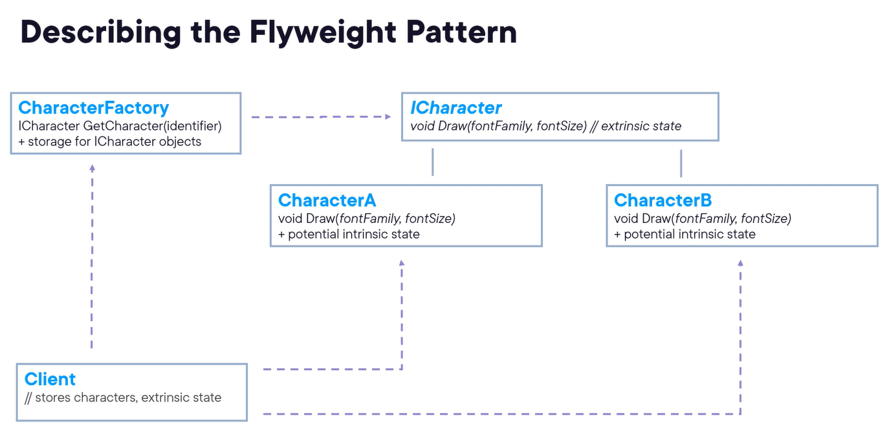

# Flyweight Pattern
- Characters of a document
- Intrinsic and extrinsic state
- The intent of this pattern is to use sharing to support large number of fine-grained objects efficiently. It does that by sharing parts of the state between these objects instead of keeping all that state in all of the objects. 

## Structure of flyweight

## Questions to ask before chossing the Flyweight Pattern
1. Doesapplication use a large number of objects?
2. Are storage costs high because of the large amount of objects?
3. Can most of the object state be made extrinsic?
4. If you remove extrinsic state, can a large group of objects be replaced by relatively few shared objects?
5. Does the application require object identity?

## Use Cases
- When the application use a large number of objects
- When storage costs are hight because of the large amount of objects
- When most of the object state be made extrinsic
- When, if you remove extrinsic state, a large group of objects be replaced by relatively few shared objects
- When the application does not require object identity

## Examples:
- Music playback
- Inventory management systems
- Document parsing and analysis
- Game development

## Pattern Consequences
- you may save alot of memory when using the pattern for an applicable use case
- Processing costs might go up, but that is typically offseted by the reduced storage costs
- The pattern is complex, which makes the code base more complicated as well