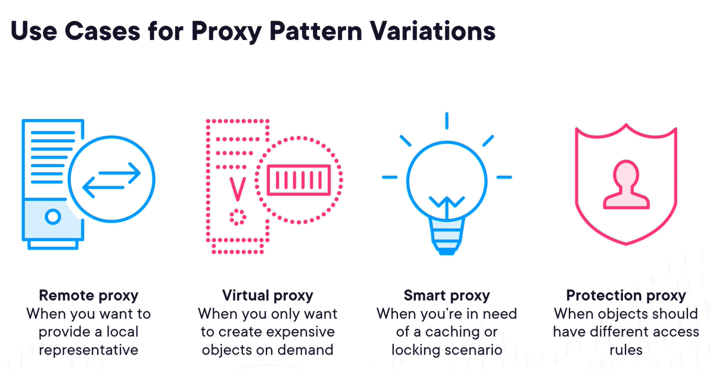
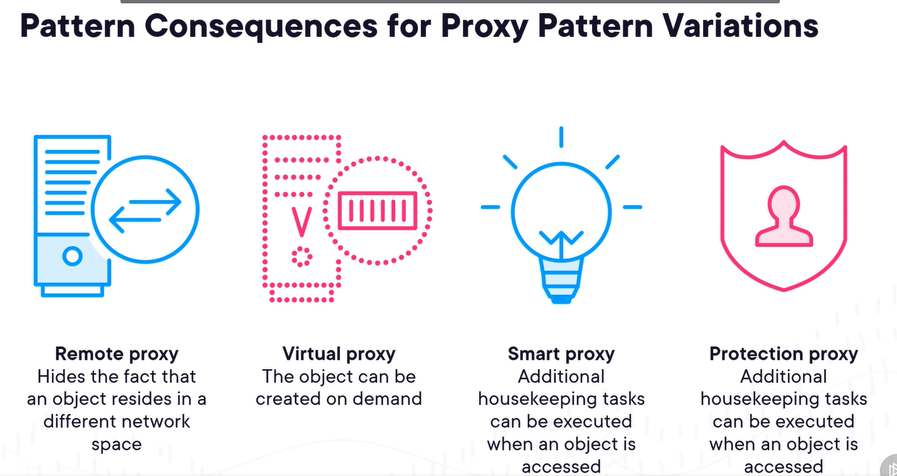

# Proxy Pattern
The intent of this pattern is to provide a surrogate or placeholder for another object to control access to it

## Description
- Accessing a remote API from an application
> "Add Service Reference" generates a proxy to interact with an API

- Proxy is responsibile for controlling the actual access to the remote API
> Provides an interafce indentical to the actual caa (although this sometimes divered from...)

## Structure
- Subject **defines the common interface between the ** RealSubject **and the** Proxy

## Implementation Senario - Document Object
 - Virtual proxy to ensure creation only happens when needed
 - Protection proxy to add a restriction on who can access the document

 ## Use Cases
 ### Type of Proxies
 

 ### Examples:
- proxy for gathering metrics
- proxy for feature toggling
- proxy for performance optimization
- proxy for rate limiting

## Consequnces
- It allows introducing new proxies without changing the client code: `open/closed principle`
- Added complexity because of addtional classes
- Performance impact of passing through addtional layers
***
 

